# img-preview-script - 图片预览工具

一个纯 Node.js 脚本，无需任何依赖，快速查看特定目录及其子目录的图片，支持快速预览查看。

## 功能介绍

**img-preview-script** 是一个纯 Node.js 脚本，无需任何依赖，为开发者提供高效的图片管理和代码生成解决方案。

### 核心功能

#### 🖼️ 图片预览与管理
- **快速预览**：一键扫描目录下所有图片，支持多层级文件夹遍历
- **智能排序**：支持按宽度、高度、路径、体积等多种维度排序
- **实时搜索**：文件名过滤，快速定位目标图片
- **多背景模式**：白色、灰色、棋盘格三种背景，适配不同图片类型
- **图片详情**：显示尺寸、大小、路径等完整信息，支持一键复制

#### ⚡ 代码自动生成（核心亮点）
这是本工具的核心价值功能，专为开发者设计：

- **智能代码生成**：自动将图片资源转换为可直接使用的代码片段
- **多格式支持**：支持 Import、Require、HTML img、Markdown、CSS url 等多种代码格式
- **自定义模板**：支持完全自定义代码模板，使用变量占位符灵活配置
- **一键复制**：生成的代码可直接复制到剪贴板，无缝集成到开发工作流


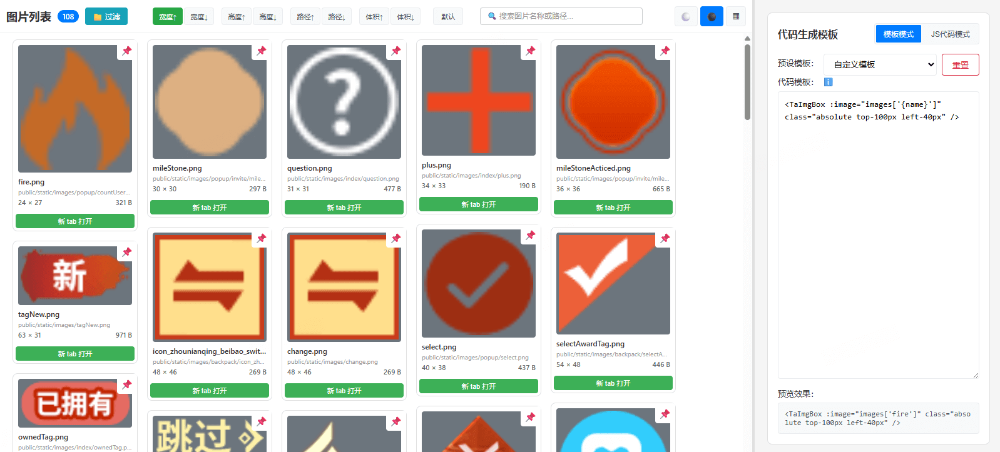

## 需求背景

项目中图片众多，文件夹层级多，不方便快速查阅。传统的文件浏览器需要逐层打开文件夹，效率低下。本工具提供了一种更高效的图片查看方式，支持一次性扫描目录下所有图片，并提供丰富的预览和管理功能。

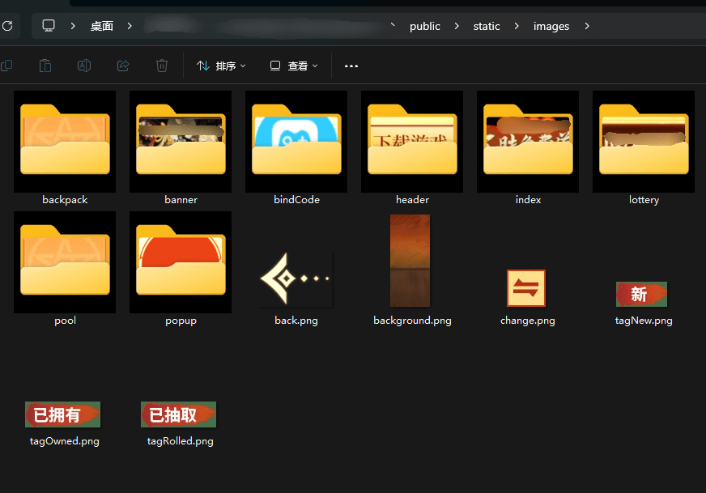

## 使用教程

### 脚本安装及使用

#### 安装

通过 npm 全局安装：

```bash
npm install -g img-preview-script
```

#### 基本使用

安装完成后，在任意目录下运行：

```bash
img-preview
```

脚本会自动启动本地服务器（默认使用 20000-25000 之间的随机端口）并打开浏览器，展示当前目录下的所有图片。

#### 支持的参数

| 参数 | 简写 | 说明 | 默认值 |
|------|------|------|--------|
| `--port <端口>` | `-p` | 指定服务器端口 | 20000-25000 随机端口 |
| `--dir <目录>` | `-d` | 指定要扫描的图片目录 | 当前工作目录 |
| `--help` | `-h` | 显示帮助信息 | - |

#### 使用示例

**1. 使用默认设置（随机端口，扫描当前目录）**
```bash
img-preview
```

**2. 指定端口**
```bash
img-preview -p 8080
```

**3. 指定扫描目录**
```bash
img-preview -d ./images
```

**4. 组合使用多个参数**
```bash
img-preview -p 8080 -d ./images
```

**5. 查看帮助信息**
```bash
img-preview -h
```

#### 支持的图片格式

- `.jpg` / `.jpeg`
- `.png`
- `.gif`
- `.bmp`
- `.webp`
- `.svg`

#### 注意事项

- 服务器启动后会自动打开浏览器访问预览页面
- 如果未指定端口，将使用 20000-25000 之间的随机端口
- 如果未指定目录，将扫描执行脚本时的工作目录及其子目录
- 服务器会自动跳过 `node_modules` 和以 `.` 开头的目录（如 `.git`）

### 排序功能

支持多种排序方式，方便快速查找和整理图片：

- **宽度排序**：按图片宽度升序或降序排列
- **高度排序**：按图片高度升序或降序排列
- **路径排序**：按文件路径字母顺序排列
- **体积排序**：按文件大小排序

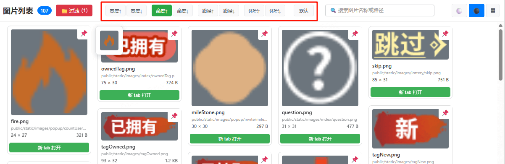

### 文件名过滤功能

在搜索框中输入关键词，可以快速过滤出包含该关键词的图片文件，支持实时搜索。

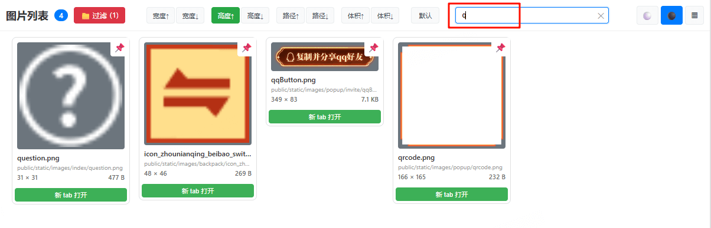

### 图片背景切换功能

支持三种背景模式，方便查看不同透明度的图片：

- **白色背景**：适合查看深色图片
- **灰色背景**：中性背景，通用性强
- **棋盘格背景**：透明背景标识，方便查看带透明度的 PNG 图片

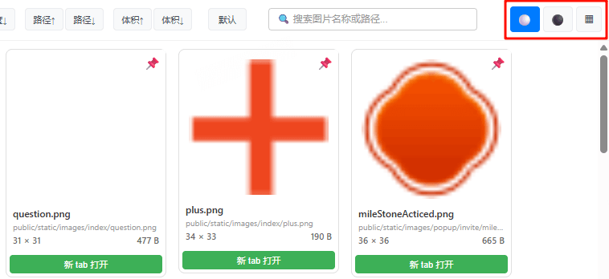
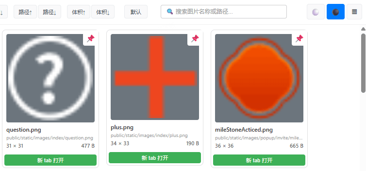
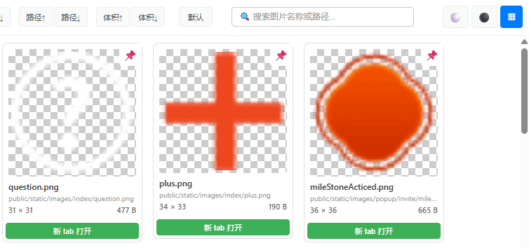

### 钉住功能

可以将重要的图片钉在顶部，方便随时查看。钉住的图片会始终显示在列表顶部，不受排序影响。

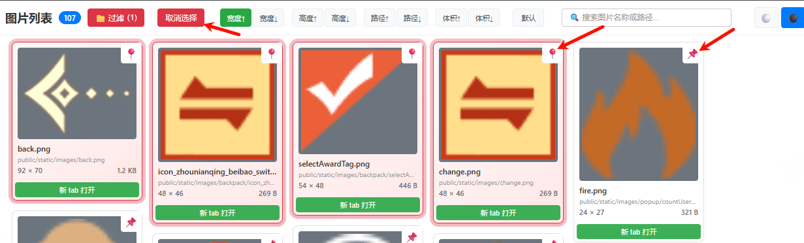

### 图片预览

点击图片可以进入大图预览模式，方便查看图片细节。

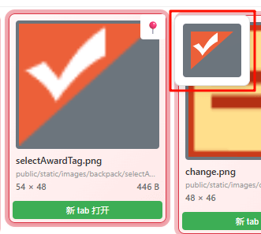

### 新 tab 打开功能

支持在新标签页中打开图片，方便使用浏览器原始能力查看图片细节

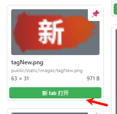

### 图片详情及其点击复制功能

附带详细的图片信息，点击对于区域，可直接复制相关信息
- 文件名
- 文件路径
- 图片尺寸（宽度 × 高度）
- 文件大小


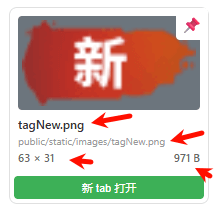

### 文件夹过滤功能

可以按文件夹进行过滤，只显示指定文件夹下的图片，方便管理大型项目的图片资源。

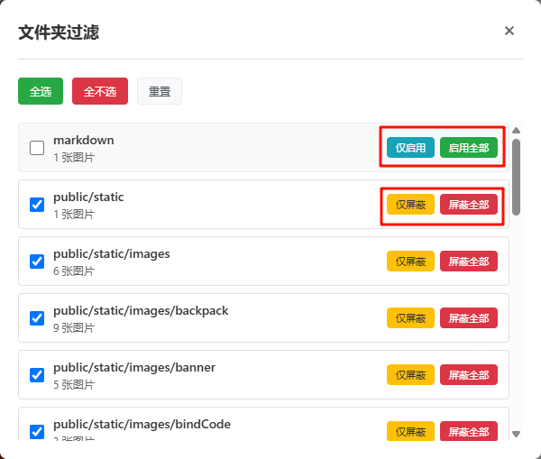

### 代码生成功能

这是本工具的核心功能，专为提升开发效率而设计。

#### 功能价值

**为什么需要代码生成功能？**

在开发过程中，我们经常需要：
1. **批量导入图片资源**：手写数十上百个 import 语句，耗时且容易出错
2. **生成文档代码**：编写文档时需要生成 Markdown 图片语法
3. **组件库开发**：需要将图片路径转换为组件 props 或配置
4. **多格式切换**：同一个项目可能需要 Import、Require 等多种格式

**传统方式 vs 代码生成：**

| 传统方式 | 使用代码生成 |
|---------|------------|
| 手动复制粘贴文件路径 | 自动获取完整路径 |
| 逐个修改导入语句 | 批量生成统一格式 |
| 容易出错（路径错误、格式不一致） | 格式统一，准确无误 |
| 耗时（一张图片需要 10-30 秒） | 秒级生成（多张图片一键生成） |
| 无法批量处理 | 支持多选批量生成 |

**实际应用场景：**

- ✅ **前端项目开发**：快速生成 `import icon from './assets/icon.png'` 语句
- ✅ **React/Vue 组件库**：批量生成图片组件的 props 配置
- ✅ **文档编写**：自动生成 Markdown 图片语法 ``
- ✅ **CSS 开发**：生成背景图片路径 `background-image: url('path/to/image.png')`
- ✅ **静态资源管理**：生成资源清单 JSON 文件

#### 预设模板

提供了 6 种常用的代码模板，覆盖主流开发场景：

1. **Import 语句**：`import icon from './assets/icon.png'`
   - 适用于：ES6+ 模块化项目、React、Vue 等现代前端框架

2. **Require 语句**：`const icon = require('./assets/icon.png')`
   - 适用于：CommonJS 模块、Node.js 项目

3. **HTML img 标签**：``
   - 适用于：静态 HTML、模板文件

4. **Markdown 图片语法**：``
   - 适用于：文档编写、README、博客文章

5. **CSS url 引用**：`background-image: url('./assets/icon.png')`
   - 适用于：CSS 样式文件、SCSS/LESS

6. **仅路径输出**：`./assets/icon.png`
   - 适用于：配置文件、JSON 数据、自定义格式

所有预设模板都支持编辑和自定义，修改后会自动保存到本地存储。

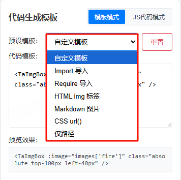
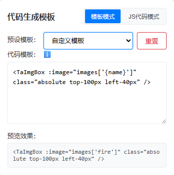

#### 生成函数自定义

对于特殊需求，支持完全自定义代码模板，使用变量占位符灵活配置：

**支持的变量：**

| 变量 | 说明 | 示例 |
|------|------|------|
| `{path}` | 文件相对路径 | `./assets/images/icon.png` |
| `{name}` | 文件名（不含扩展名） | `icon` |
| `{fullname}` | 完整文件名 | `icon.png` |
| `{width}` | 图片宽度（像素） | `100` |
| `{height}` | 图片高度（像素） | `100` |
| `{size}` | 文件大小（字节） | `2048` |
| `{ext}` | 文件扩展名 | `png` |

**自定义模板示例：**

```javascript
// React 组件示例
const {name} = () => 

// Vue 组件示例
<template>
  
</template>

// JSON 配置示例
{
  "name": "{name}",
  "url": "{path}",
  "size": "{width}x{height}",
  "fileSize": "{size} bytes"
}

// 带注释的代码
// {fullname} - {width}x{height}
import {name} from '{path}';
```

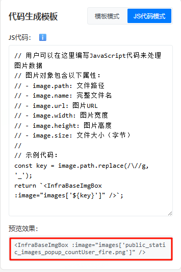

#### 点击复制生成的代码

生成的代码支持一键复制到剪贴板，可以直接粘贴到代码编辑器中，无需手动修改，大幅提升开发效率。

**使用流程：**
1. 选择一张或多张图片
2. 选择代码模板（预设模板或自定义模板）
3. 查看生成的代码预览
4. 点击复制按钮，代码自动复制到剪贴板
5. 在代码编辑器中粘贴即可使用

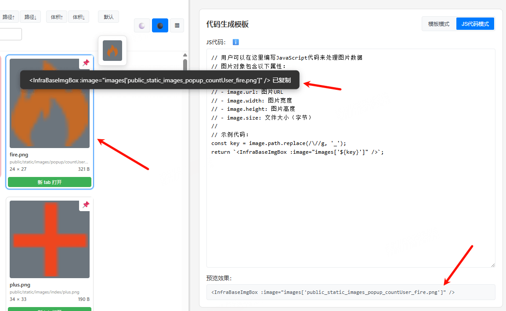

## 安全性

- **纯前端工具**：所有数据处理都在本地进行，不经过后端服务器，没有安全性问题
- **代码完全开源**：代码无混淆，完全可查阅，方便审查和二次开发
- **本地运行**：所有数据都在本地，不会上传到任何服务器

## 相关链接

- **npm 地址**：https://www.npmjs.com/package/img-preview-script
- **Git 仓库**：https://github.com/Momo707577045/img-preview-script

## 技术特点

- ✅ 零依赖，纯 Node.js 实现
- ✅ 跨平台支持（Windows、macOS、Linux）
- ✅ 快速扫描，支持大目录
- ✅ 响应式设计，适配不同屏幕
- ✅ 本地存储，设置自动保存
- ✅ 开源免费，MIT 协议

## 许可证

MIT License
